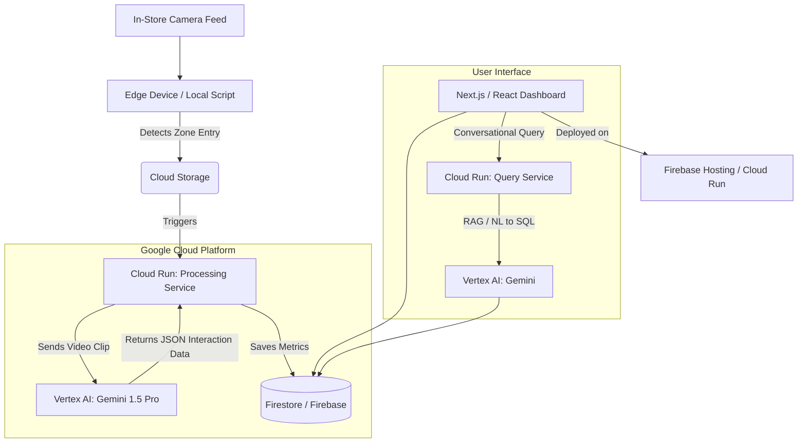

# Architecture & Implementation Plan

## 1. Google Cloud Architecture

To meet the requirement of building on Google Cloud tools and deploying on Cloud Run/Firebase, we will use a serverless, scalable architecture.

### Component Breakdown
1. **Edge/Local Script (Python):** A lightweight script running locally (or on a Raspberry Pi/Jetson). It uses simple motion detection or YOLO object tracking (which you already have in `main.py` using `yolov8m.pt`) to detect when a person enters a specific "Interaction Zone". It records a short video clip and uploads it to GCP.
2. **Cloud Storage:** Stores the short video clips temporarily for processing.
3. **Cloud Run (Processing Service):** A Python API. When a new video hits Cloud Storage, this service is triggered. It calls the Vertex AI API with the video and a specific prompt to analyze the customer's interaction.
4. **Vertex AI (Gemini 1.5 Pro):** The "brain" of the operation. It performs multimodal analysis on the video clip and returns structured JSON (e.g., `{"product": "shampoo", "interaction_type": "picked_up", "dwell_time_seconds": 8}`).
5. **Firestore (Database):** A NoSQL database that stores all interaction events, timestamps, and metadata.
6. **Next.js Dashboard:** The frontend application where executives view charts and the Gen AI chat interface. Deployed via Firebase Hosting or Cloud Run.

---

## 2. Phased Implementation Plan

### Phase 1: The Core Pipeline (Local to Cloud)
*   **Goal:** Successfully get a video clip from a local script, processed by Gemini, and saved to a database.
*   **Tasks:**
    *   Set up GCP Project, enable Vertex AI, Cloud Storage, and Firestore APIs.
    *   **Data Source:** Instead of a live camera for the prototype, we will download ~10 sample clips from the **RetailAction Dataset** (top-down views of customers taking, touching, or putting back items) to act as our simulated live feed.
    *   Modify your existing `main.py` to loop these mock video feeds and trigger a video snippet upload when a bounding box stays in a defined polygon (zone) for > 3 seconds.
    *   Upload that clip to a GCP bucket.
    *   Write a simple Python script to pass that video from the bucket to Gemini 1.5 Pro using the Vertex AI SDK and parse the response into Firestore.

### Phase 2: The Dashboard & API
*   **Goal:** Visualize the data.
*   **Tasks:**
    *   Build a sleek, premium-looking Next.js application (we will use modern CSS/Tailwind for a top-tier aesthetic).
    *   Connect the frontend to Firestore to display basic metrics (Total Interactions, Average Dwell Time per Zone).

### Phase 3: The Gen AI Conversational Interface
*   **Goal:** Implement the "Chat with your Store Data" feature.
*   **Tasks:**
    *   Build an API route in Next.js that takes a user's question, fetches aggregated data from Firestore, and uses Gemini to formulate a conversational, insightful response.

### Phase 4: Polish & Documentation (For the Hackathon)
*   **Goal:** Create the deliverables (Deck, Video).
*   **Tasks:**
    *   Use the researcher agent to draft the presentation narrative.
    *   Record a crisp 3-minute video demonstrating the local camera triggering the event, the data appearing in the dashboard, and a user asking a question to the Gen AI chat.
